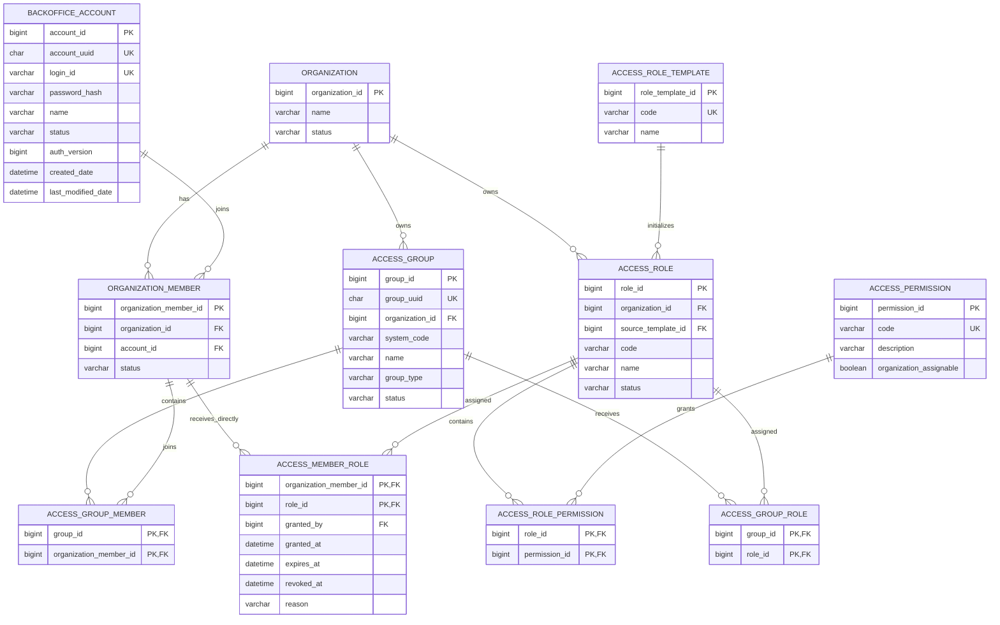
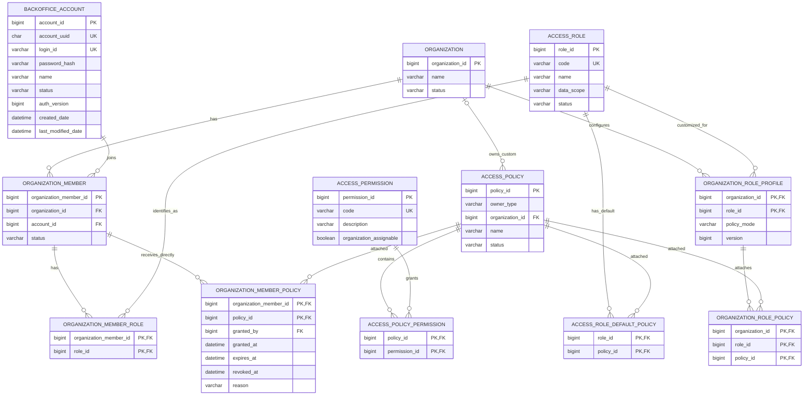

# 권한 설계 ERD 비교

최종 선택: **설계 A — 기관별 Role + Group 상속**

두 설계 모두 기존 어르신 앱 계정 `users`와 Java/JPA 상속 관계가 없는 신규 `backoffice_account`를 사용한다. `organization_member`는 백오피스 계정의 기관별 소속이며 Role과 Group은 이 멤버십에 연결한다. `Permission`은 API에서 검사하는 최소 행동이고, 어르신 조회 범위는 `care_assignment`나 보호자 연결 관계로 별도 검사한다.

## 설계 A: 기관별 Role + Group 상속

기관마다 Role을 생성하고 Permission을 직접 매핑한다. 구성원은 Group에서 Role을 상속하거나 개인 Role을 추가로 받는다.



권한 계산:

```text
Group에서 받은 Role의 Permission
          +
개인에게 직접 부여한 Role의 Permission
          =
구성원의 최종 Permission
```

기관마다 `access_role`과 `access_role_permission`을 보유하므로 커스텀은 직관적이다. 대신 기본 Role 변경을 여러 기관에 전파하거나 템플릿과 기관 Role의 차이를 관리해야 한다. Group이 실제 운영에 필요하지 않아도 권한 경로의 중심에 들어간다.

## 설계 B: 전역 Role + 부착 가능한 Policy

Role은 `ORG_ADMIN`, `CARE_WORKER`, `GUARDIAN` 같은 전역 의미와 기본 데이터 범위를 나타낸다. 실제 Permission 묶음은 Policy에 두고, 기관은 Role을 복제하지 않은 채 Policy 연결만 상속·추가·교체한다. 개인 예외도 Policy로 부여한다.



`ACCESS_POLICY.organization_id`는 `owner_type = SYSTEM`이면 `NULL`, `owner_type = ORGANIZATION`이면 소유 기관 ID다. `ORGANIZATION_ROLE_PROFILE`은 기관이 기본 설정을 변경할 때만 만든다.

권한 계산:

```text
Role의 System 기본 Policy
          │
          ├─ profile 없음  : 기본 Policy 사용
          ├─ INHERIT       : 기본 Policy + 기관 Policy
          └─ REPLACE       : 기관 Policy만 사용
                                  +
                         개인 추가 Policy
                                  =
                         최종 Permission
```

Role의 `data_scope`는 Permission과 별도로 적용한다.

```text
ORG_ADMIN   → ORGANIZATION
CARE_WORKER → ASSIGNED_RECIPIENT
GUARDIAN    → LINKED_RECIPIENT
```

## 구조 비교

| 비교 기준 | 설계 A: 기관별 Role + Group | 설계 B: 전역 Role + Policy |
|---|---|---|
| 기관별 Role 행 | 기관 생성 시 Role 생성 또는 복사 | 생성하지 않음 |
| 커스텀 단위 | 기관 Role의 Permission 매핑 | 기관 Policy 및 Role-Policy 연결 |
| 기본값 제공 | Role Template 복사 | System Policy 연결 |
| 기본값 변경 전파 | 복사본 동기화 정책 필요 | 커스텀하지 않은 기관은 기본 Policy를 바로 사용 |
| 개인 추가 권한 | 개인에게 추가 Role 부여 | 개인에게 추가 Policy 부여 |
| Group 필요성 | 핵심 권한 경로에 포함 | 필요할 때 Policy 부착 대상으로 추가 가능 |
| Role의 의미 | 기관별 권한 묶음 | 전역 사용자 유형과 데이터 범위 |
| IAM 유사성 | 일반적인 다중 기관 RBAC | 관리 Policy를 부착하는 IAM형 모델에 가까움 |
| 초기 구현 난이도 | 비교적 단순 | Policy/profile 해석 로직이 추가됨 |
| 장기 확장 | 기관 Role 복사본 관리 필요 | Group·개인·서비스 계정으로 Policy 부착 확장 가능 |

## 최종 선택: 설계 A

기관별 Role에서 Permission을 직접 조합하고, Group에 Role을 부여하며, 개인 예외는 추가 Role로 처리하는 설계 A를 선택한다.

1. `access_role_template`은 SAFORI가 제공하는 기본 Role 구성을 정의한다.
2. 기관 생성 시 템플릿을 기준으로 기관 소유 `access_role`과 `access_role_permission`을 생성한다.
3. 기본 Group에는 해당 기관의 Role을 연결한다.
4. 개인 추가 권한은 작은 목적별 Role을 `access_member_role`로 부여한다.
5. API는 최종 Permission을 검사하고, 기관·배정·보호자 연결 등 데이터 범위는 별도 정책으로 검사한다.
6. 기본 템플릿이 변경돼도 기존 기관 Role을 자동 덮어쓰지 않는다. 템플릿 버전과 차이를 확인한 뒤 기관이 선택적으로 반영한다.

`access_group.system_code`는 시스템 기본 Group에만 사용하고 사용자 정의 Group은 `NULL`로 둔다. 화면에 노출하는 안정적인 식별자는 `group_uuid`를 사용한다. 권한 판정은 Group 코드가 아니라 연결된 Role과 Permission을 기준으로 수행한다.

설계 B는 비교 자료로 유지한다. Policy Statement, `DENY`, 조건식, 리소스 패턴이 실제로 필요해질 때 별도 마이그레이션 대상으로 다시 검토한다.
