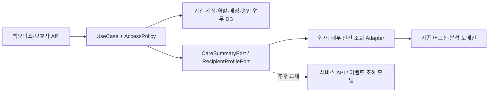

# 기관 관리자·담당자·보호자 권한 구현 계획

상태: 구현 전 설계·작업 준비 완료. 실행 코드와 DB DDL은 후속 작업에서 변경한다.

- GitHub: [이슈 #135](https://github.com/safori-team/SAFORI-Server/issues/135)
- 작업 브랜치: `feat/#135` — `origin/develop`의 `0647bebb983a7f5f3db6654fce34cc8db69f1190`에서 생성, GitHub Development에 연결
- Notion: [권한 초기 기획안](https://app.notion.com/p/peterpark0506/3e5d3e8fe84c80bb95dcdefaeb966622)
- 검토 입력: 사용자가 첨부한 권한표·기관 조직도, `SAFORI.txt`, 로컬 caring-back MSA, SAFORI 현재 코드
- 사용자 확정: 담당자·보호자는 **기관 초대·승인**으로 가입한다. **이전 업무일지 열람은 승인 후 허용**한다.

## 1. 요구사항과 해석

사진은 구현할 권한 기준이다. SAFORI.txt는 여러 서비스의 현장 사례이므로 기관별 계정 생성 방식, 퇴사·탈퇴, 시범 종료 시 일괄 삭제를 모두 SAFORI 요구사항으로 채택하지 않는다. 담당자가 바뀌어도 대상자의 데이터와 작성자 이력을 유지한다.

| 기능 | 기관 관리자 ORG_ADMIN | 담당자 CARE_WORKER | 보호자 GUARDIAN |
|---|---|---|---|
| 어르신 조회 | 소속 기관 전체 | 현재 본인 배정 대상 | 현재 연결 대상 |
| 담당자별 배정 대상 조회 | 소속 기관만 가능 | 불가 | 불가 |
| 상태·조치 조회 | 소속 기관 | 본인 배정 대상 | 연결 대상의 공개 허용 항목만 |
| 확인 사유·자동 분석 근거 | 소속 기관, 원문 제외 | 본인 배정 대상, 원문 제외 | 불가 |
| 업무일지 작성·업무 완료 | 소속 기관 | 현재 본인 배정 대상 | 불가 |
| 대상자 등록·담당자 배정/변경/해제 | 소속 기관만 가능 | 불가 | 불가 |
| 보호자 연결·해제 | 소속 기관만 가능 | 불가 | 불가 |
| 어르신 일기·녹음·상담 원문 | 비공개 | 비공개 | 비공개 |
| 이전 담당자의 업무일지 | 소속 기관 이력 조회 제안 | 현재 배정 + 별도 승인 필요 | 내부 업무일지 비공개 |

마지막 행은 사용자 답변을 반영한 추가 정책이다. **승인자는 소속 기관 관리자**, 관리자 자신의 기관 내 이력 조회는 관리 권한으로 허용하는 안을 제안한다. 이 두 세부사항은 구현 전 운영 정책으로 확정한다. 승인이 어르신의 원문 공개까지 허용하지는 않는다.

기관 관리자는 전체 서비스의 슈퍼관리자가 아니다. 기관 A의 관리자에게 기관 B의 데이터를 허용하지 않는다. 업무일지는 직원의 활동 기록이며 어르신 마음일기와 다른 데이터다.

초기 제안은 기관별 어르신 1명당 활성 주담당자 1명, 보호자는 복수 연결이다. 기관 동시 소속, 공동 담당, 과거 공개 안내의 조회 기간은 미확정이다. DB는 기관 기준으로 관계를 관리하되 초기 서비스 정책은 어르신의 활성 소속 기관 하나를 전제로 검증한다.

## 2. 현재 SAFORI와 caring-back에서 확인한 내용

| 확인 지점 | 현재 동작 | 변경 계획 |
|---|---|---|
| build.gradle | Boot 3.4.1, Java 17, JPA, Security, MySQL | 버전 업그레이드 없이 현 의존성에 맞춰 구현·검증 |
| users / User / Role | USER, NOT_ALLOWED만 존재 | 어르신 계정은 유지하고 백오피스 계정·기관 역할을 별도 테이블로 구성 |
| SecurityConfig | 공개 경로 외 authenticated 요구 | 백오피스 인증 경계, 메서드 인가, 기본 거부 경로 추가 |
| UserTokenServiceImpl | JWT auth claim 기반 인증 복원, 만료 예외의 claims 반환 | 만료 토큰 거부를 선행 수정. 백오피스는 DB 활성 상태/역할/관계를 매 요청 검사 |
| GetUserVoiceDetailUseCase | 본인 username 검사 후 원문·presigned URL 반환 | 기존 소유자 검사는 유지. 백오피스용 안전한 조회 모델/DTO를 별도 제공 |
| application.yml | JPA_DDL_AUTO 기본값 update | 실제 운영값 확인 후 버전 migration + validate로 전환 계획 |
| safori.sql | 초기 생성용 CREATE TABLE IF NOT EXISTS와 별도 CREATE INDEX | 신규 설치 스키마와 기존 DB migration을 구분. 파일 전체 재실행을 migration으로 사용하지 않음 |

caring-back 참고 지점:

- `CARING-Back-Manager/.../entity/ManagerGroup.java`: manager와 userUuid의 연결 테이블이다. 담당자 그룹 개념을 관계 테이블로 모델링한 점을 참고한다.
- `ManagerGroupRepository`: 담당자별 userUuid 조회와 exists 검사를 한다. SQL GROUP BY 기반 권한은 아니다.
- `SuperAuthority`, `PersonalSuperAuthority`: 권한 카탈로그와 관리자별 매핑을 분리한다. SAFORI는 먼저 역할별 권한 + 기관 멤버십으로 단순화하고, 임의 개인별 권한 편집 화면은 후속 범위로 둔다.
- `@ManagerRoles` / `RolesArgumentResolver`: roles 헤더를 인자로 주입한다. 어노테이션 자체가 허용/거부를 결정하지 않는다. `RoleUtil` 수동 호출 누락 가능성을 표준 Method Security로 줄인다.
- Gateway의 `ManagerAuthorizationHeaderFilter`와 Manager의 HMAC 검사: 서비스 간 신뢰 경계가 존재한다. SAFORI 분리 시 임의 roles/member-code 헤더를 신뢰하지 않고 검증된 토큰/서비스 인증 계약을 사용한다.
- `GetGroupedUserListByManagerUseCase`는 주석 처리되어 있으므로 완성된 동작으로 가정하지 않는다.

## 3. 권한 모델: 행동 + 대상 범위 + 공개 필드

허용 조건은 활성 기관·계정·멤버십 AND 기관 내 역할 권한 AND 대상 관계 AND 해당 필드/이력 공개 정책이다. 역할 이름만 비교하거나 관리자를 모든 검사에서 우회시키지 않는다.

| 권한 코드 | 기본 부여 역할 | 추가 제한 |
|---|---|---|
| RECIPIENT_READ | 관리자, 담당자, 보호자 | 각각 기관 전체 / 현재 배정 / 현재 연결; 역할별 최소 정보 DTO |
| ASSIGNMENT_READ | 관리자 | 기관 내 담당자와 배정만 |
| CARE_STATUS_READ | 관리자, 담당자 | 기관 전체 / 현재 배정 |
| CARE_REASON_READ | 관리자, 담당자 | 원문 인용 없는 구조화 근거만 |
| GUARDIAN_STATUS_READ | 보호자 | 현재 연결 + PUBLISHED 상태인 공개 전용 자료 |
| WORK_LOG_READ | 관리자, 담당자 | 담당자는 현 배정 기간 내 생성된 기록; 이전 기록은 별도 승인 |
| WORK_LOG_WRITE, CARE_TASK_COMPLETE | 관리자, 담당자 | 기관 전체 / 현재 배정; 작성자를 서버에서 기록 |
| RECIPIENT_CREATE, ASSIGNMENT_MANAGE | 관리자 | 기관 내부만; 타 기관 담당자 배정 거부 |
| GUARDIAN_LINK_MANAGE, MEMBER_MANAGE | 관리자 | 기관 내부만; 임의 관리자 승격은 초기 공개 API에서 제외 |
| WORK_LOG_HISTORY_READ | 관리자, 담당자 | 담당자는 활성 열람 승인과 현재 배정이 추가로 필요 |
| WORK_LOG_HISTORY_APPROVE | 관리자 | 동일 기관, 요청자와 승인자 분리, 허용 범위·만료 필수 |
| CARE_PUBLICATION_MANAGE | 관리자 | 보호자 공개 초안 검토·발행·회수; 초기 제안 |

`RAW_CONTENT_READ` 같은 권한은 기본 역할에 제공하지 않는다. 역할 권한과 열람 승인 모두 허용하는 경우에만 접근한다. 승인 데이터 자체가 역할/기관 경계를 우회할 수 없다. 복수 역할이 있어도 기관 컨텍스트를 섞지 않는다.

## 4. DB 추가 설계

다음은 **논리 스키마 제안**이다. 이번 준비 단계에서 실행 가능한 DDL을 기존 safori.sql에 넣거나 운영 DB에 적용하지 않는다. 기본 PK는 bigint, 외부 노출 식별자는 UUID 등 안정된 별도 키, 생성/수정 시각은 기존 datetime(6) 패턴을 따른다. 시각은 UTC로 일관되게 저장한다.

| 신규 테이블 | 주요 컬럼 | 제약/인덱스와 용도 |
|---|---|---|
| organization | organization_id, public_id, name, status | public_id UNIQUE; 활성 기관 여부 |
| backoffice_account | account_id, public_id, login_id, password_hash, status, auth_version | login_id/public_id UNIQUE; 어르신 users와 인증 영역 분리 |
| organization_member | member_id, organization_id, account_id, status, invited_by, approved_by, approved_at, revoked_at | UNIQUE(org, account), UNIQUE(org, member); INVITED/PENDING/ACTIVE/SUSPENDED/REVOKED |
| access_role | role_id, code, name | code UNIQUE; ORG_ADMIN/CARE_WORKER/GUARDIAN seed |
| access_permission | permission_id, code, description | code UNIQUE; DB 매핑 코드와 Java 상수 계약 검사 |
| access_role_permission | role_id, permission_id | 복합 PK; 역할별 최소 권한 seed |
| organization_member_role | organization_id, member_id, role_id | 복합 PK(member, role); (org, member) 복합 FK |
| care_recipient | recipient_id, organization_id, user_id nullable, public_id, status | UNIQUE(org, user_id), UNIQUE(org, recipient_id), public_id UNIQUE; 계정 활성화 전 등록 지원 |
| care_assignment | assignment_id, organization_id, recipient_id, worker_member_id, started_at, ended_at, assigned_by, ended_by, reason | 대상/멤버의 (org, id) 복합 FK; 활성 배정 중복 방지; 담당자 조회 인덱스 |
| guardian_recipient_link | link_id, organization_id, recipient_id, guardian_member_id, started_at, ended_at, linked_by, ended_by | (org, recipient)/(org, member) 복합 FK; 활성 동일 쌍 중복 방지 |
| work_log_access_request | request_id, organization_id, recipient_id, requester_member_id, assignment_id, from_at, to_at, reason, status, reviewed_by, reviewed_at | PENDING/APPROVED/REJECTED/CANCELLED; 요청/결정은 감사 대상 |
| work_log_access_grant | grant_id, request_id, organization_id, recipient_id, grantee_member_id, assignment_id, from_at, to_at, granted_by, granted_at, expires_at, revoked_at | request_id UNIQUE; 대상/수혜자/배정 동일 기관 FK; 수혜자+대상+만료 인덱스 |
| access_audit_log | audit_id, organization_id, actor_account_id, action, resource_type, resource_id, result, occurred_at, request_id | org+시간, actor+시간; 변경/승인/민감 조회 기록; 원문·비밀번호·토큰은 저장 금지 |

이후 업무 API 단계에서 다음 테이블을 추가한다. 기존 voice/chat 테이블을 업무일지로 재사용하지 않는다.

| 업무 테이블 | 주요 컬럼 | 공개/보존 정책 |
|---|---|---|
| care_work_log | work_log_id, organization_id, recipient_id, author_member_id, assignment_id nullable, body, occurred_at, created_at | 작성자와 작성 당시 배정 보존, 삭제/재배정으로 작성자를 덮어쓰지 않음 |
| care_action | action_id, organization_id, recipient_id, status, reason_code, safe_evidence, completed_by, completed_at, version | 내부 조치 및 업무 완료; 낙관적 잠금과 중복 완료 방지 |
| care_publication | publication_id, organization_id, recipient_id, action_id, safe_status, public_message, status, published_by, published_at, revoked_at | DRAFT/PUBLISHED/REVOKED; 보호자 응답은 이 allowlist 기반 모델만 사용 |

DB 무결성 세부안:

1. 모든 기관 소유 행에 organization_id를 넣는다. 배정 대상과 담당 멤버가 같은 기관인지 복합 FK로 보장하고, 멤버가 ACTIVE CARE_WORKER인지 서비스 트랜잭션에서 추가 검증한다. 보호자도 ACTIVE GUARDIAN을 검사한다.
2. 배정 이력은 ended_at으로 종료하고 새 행을 만든다. `UNIQUE(recipient_id, ended_at)`만으로는 NULL인 활성 행 중복을 막지 못한다. MySQL 지원 버전을 확인한 뒤 `CASE WHEN ended_at IS NULL THEN recipient_id ELSE NULL END` 생성 컬럼과 UNIQUE(org, active_recipient_id)를 사용하거나 현재 배정 테이블을 별도 분리한다. 보호자 연결도 활성 대상·보호자 쌍에 같은 원칙을 적용한다.
3. 재배정은 recipient 행을 SELECT FOR UPDATE로 잠그고 기존 배정 종료 → 새 배정 삽입을 한 트랜잭션으로 수행한다. 권한 회수/업무 쓰기는 동일한 잠금 순서(org → membership → recipient → assignment)를 정하고 상태를 재검증한다. 이미 진행 중인 요청은 트랜잭션 순서에 따라 결정하며 응답 전송을 소급 취소한다고 약속하지 않는다.
4. 배정 인덱스는 (org, worker_member_id, ended_at, recipient_id), 보호자 연결은 (org, guardian_member_id, ended_at, recipient_id)를 둔다. 목록·count와 승인 범위 조회 실행계획을 확인한다.
5. 소속 종료/퇴사는 멤버십 비활성화 및 관계 종료로 처리한다. 업무 기록/승인/감사 이력을 계정 삭제 CASCADE로 제거하지 않는다. 운영 보존/삭제 기간은 별도 확정한다.
6. 기존 users에 일괄 관리자 역할/기관을 부여하지 않는다. recipient와 users 연결은 소유 확인/초대 활성화 절차를 거친다. 기관 이전 시 이전 소속·배정·연결을 종료하고 과거 기록의 기관 소유권은 그대로 둔다.

신규 설치는 safori.sql snapshot에 신규 테이블/seed를 반영한다. 기존 설치는 데이터 보존용 migration으로 추가한다. 현재 migration 도구 의존성이 없으므로 Flyway 도입을 제안하되 첫 배포에서 기존 schema baseline을 확인하고, seed는 권한 code를 키로 멱등 처리한다. 먼저 additive migration → 기존 기능 회귀 확인 → 신규 API 활성화 순서로 배포한다. 실패 시 API를 비활성화하고 이전 앱으로 되돌리며, 데이터가 생긴 신규 테이블은 자동 DROP하지 않는다. 운영 MySQL 버전과 실제 DDL_AUTO 값은 아직 확인하지 않았다.

## 5. 이전 업무일지 승인 흐름

사용자 결정: 이전 업무일지를 보려면 승인이 필요하다. 아래는 이를 구현하는 구체안이다.

1. 새 담당자가 현재 배정 대상의 이전 업무일지에 대해 요청한다. 요청에는 대상, 읽을 기록 기간, 요청 사유를 넣는다. 요청 API는 승인 전 제목·본문·작성자 목록을 미리 노출하지 않는다.
2. 같은 기관 관리자가 현재 배정과 기록 범위를 확인하고 승인/거절한다. 승인 시 필수 만료일을 지정하고, 요청자 자신이 승인하지 못한다. 기본 유효 기간은 운영 정책 확정 후 정한다.
3. 승인은 account 전체에 주는 영구 권한이 아니다. 수혜 member, recipient, assignment, 기록 시간 구간, 만료일에 한정한다. 범위는 `[from_at, to_at)`이며 서버 작성시각과 작성 당시 배정으로 판별한다. 클라이언트가 과거 occurred_at을 입력해 공개 범위를 바꾸지 못한다.
4. 목록/상세/count/export는 같은 승인 조건으로 조회한다. 미승인·거절·만료·회수·재배정·정지 시 차단한다. 같은 사람이 다시 배정되어도 assignment_id가 바뀌면 기존 승인은 유효하지 않다.
5. 관리자 승인/거절/회수와 승인으로 수행한 열람을 감사 기록에 남긴다. 승인 기간을 벗어난 기록, 다른 기관/어르신의 기록, 어르신 원문은 승인으로 공개되지 않는다.

## 6. Spring 구현 방식

권장 흐름은 인증 필터 → URL 권한 경계 → UseCase Method Security → 범위가 포함된 Repository 조회 → 역할별 DTO다.

백오피스는 `/v1/api/backoffice/**`, 보호자용 조회는 `/v1/api/guardian/**`로 구분하고 전용 인증 체인과 제한된 인증 경로를 둔다. 기존 `/v1/api/auth/**` permitAll 아래에 관리 기능을 넣지 않는다. 백오피스 토큰은 별도 audience/issuer와 검증 정책을 두고, 기존 사용자 체인과도 호환되지 않도록 키 또는 명시적 token kind 검사를 적용한다. 각 JWT 필터의 적용 경로와 servlet 자동 등록 여부를 점검해 두 체인에서 중복 실행하지 않는다.

초기에는 권한 cache 없이 DB에서 활성 기관/계정/멤버십/역할을 검사한다. 기존 auth claim만 신뢰하면 회수된 권한이 access token 만료까지 남을 수 있다. 계정 정지 시 refresh도 회수하고 재발급에서 상태를 다시 검사한다. 향후 cache는 auth_version과 회수 전파가 보장된 뒤 도입한다.

`@EnableMethodSecurity`를 활성화하고, 기존 `@UseCase` Spring bean의 public 메서드에 `@PreAuthorize`를 적용한다. Controller만 검사하면 다른 호출 경로를 놓칠 수 있어 UseCase를 주요 경계로 삼는다. 아래 코드는 신규 컴포넌트 설계 예시이며 현재 프로젝트에서 컴파일되는 구현은 아니다.

```java
@PreAuthorize("@backofficeAccessPolicy.canReadRecipient(authentication, #p0, #p1)")
public RecipientDetail execute(Long organizationId, Long recipientId) {
    // 검증된 actor scope로 조회하고, 역할별 허용 필드 DTO만 반환
    return scopedRecipientQuery.findDetail(organizationId, recipientId);
}
```

`#p0/#p1`은 예시에서 파라미터 이름 컴파일 옵션에 의존하지 않도록 사용했다. 실제 구현은 이름 유지 설정 또는 `@P`도 검토한다. 정책 bean은 인증 principal과 DB의 조직/배정/연결을 검증한다. 요청에서 들어온 orgId·memberId·userId를 신뢰하지 않는다.

고정 정책이 반복되면 `@CanManageAssignments` 같은 `@PreAuthorize` 메타 어노테이션으로 묶을 수 있다. 일반적인 `@Authorization`이라는 이름만 붙여서는 검사되지 않는다. Swagger `@SecurityRequirement`도 인증 문서만 만든다. 자체 AOP/ArgumentResolver로 별도 인가 엔진을 만들 필요는 없다. 복잡성이 커질 때 Spring `AuthorizationManager` 구현을 검토한다.

권한 없는 메서드 누락을 막기 위해 신규 API 경로는 명시적 허용 목록과 나머지 denyAll을 적용한다. self-invocation은 프록시 검사를 우회할 수 있으므로 같은 객체 안의 호출에 보안을 의존하지 않는다. 변경 작업은 메서드 사전 검사에 더해 트랜잭션 안에서 범위/상태를 다시 검증한다.

인증 실패는 401, 기능 권한 부족은 403, 기능은 있으나 범위 밖 대상은 일관된 404를 제안한다. 예외 처리기가 AccessDeniedException을 500으로 바꾸지 않도록 필터/ControllerAdvice를 함께 검증한다.

## 7. GROUP BY를 어디에 사용할 것인가

역할 묶음은 access_role과 매핑 테이블로 표현한다. 담당자와 어르신 묶음은 care_assignment 관계로 표현한다. SQL GROUP BY는 이 관계를 기반으로 **담당자별 배정 인원 같은 집계**를 만들 때 사용한다. 필수 기관/대상 제한은 집계 전에 적용한다.

```sql
-- 제안 스키마 기준 예시. 관리자 ASSIGNMENT_READ와 기관 멤버십 검증 후 실행.
SELECT a.worker_member_id, COUNT(*) AS recipient_count
FROM care_assignment a
JOIN care_recipient r
  ON r.organization_id = a.organization_id
 AND r.recipient_id = a.recipient_id
WHERE a.organization_id = :authorizedOrganizationId
  AND a.ended_at IS NULL
  AND r.status = 'ACTIVE'
GROUP BY a.worker_member_id;
```

이 예시는 배정 0명인 담당자는 반환하지 않는다. 0명까지 표시하려면 활성 CARE_WORKER 멤버를 기준으로 LEFT JOIN하고 배정 조건을 ON 절에 넣는다. Java/Spring Data JPA에서는 JPQL GROUP BY 또는 native @Query + projection DTO로 받는다. 조직도는 범위가 제한된 담당자/어르신 DTO 행을 조회하고 `Collectors.groupingBy`로 묶을 수 있다. 큰 데이터는 담당자 목록을 먼저 페이지 조회하고 그 ID들의 배정을 일괄 조회한다.

```sql
-- 담당자 상세/목록 조회의 범위 조건 핵심 예시.
-- 외부 정책에서 활성 기관/계정/멤버십 및 RECIPIENT_READ도 검증한다.
SELECT r.recipient_id, r.public_id
FROM care_recipient r
WHERE r.organization_id = :authorizedOrganizationId
  AND r.status = 'ACTIVE'
  AND EXISTS (
    SELECT 1 FROM care_assignment a
    WHERE a.organization_id = r.organization_id
      AND a.recipient_id = r.recipient_id
      AND a.worker_member_id = :authenticatedMemberId
      AND a.ended_at IS NULL
  );
```

JPA Specification 또는 명시적 Repository 쿼리로 같은 scope를 목록/상세/count/export에 적용한다. 권한이 없는 전체 데이터를 읽은 뒤 GROUP BY/Java filter/PostFilter로 숨기지 않는다. EXISTS는 다중 역할/관계 JOIN으로 인한 중복 행과 잘못된 페이지 count를 줄이는 데도 유용하다.

## 8. 보호자 공개와 원문 차단

보호자 응답은 별도 projection과 DTO로 만든다. 최소 대상 식별 정보, 공개 상태, 검토된 조치 안내, 공개 시각만 허용한다. 내부 reason, safe_evidence, 내부 일지, 민감 연락처, S3 key, presigned URL, voice_content.content, chat_message.user_input/bot_response는 포함하지 않는다. 금지 필드를 null로 채운 공용 DTO보다 허용 필드만 정의한 타입을 사용한다.

관리자/담당자의 분석 근거에도 원문 발췌가 포함되면 사진의 비공개 정책을 위반한다. reason_code·안전한 지표·검토된 설명으로 변환하는 port를 만들고 기존 AI summary를 무조건 안전하다고 가정하지 않는다. 보호자 안내는 별도 초안과 관리자 발행 절차를 초기안으로 둔다. 공개 철회와 보호자 연결 해제는 다음 조회부터 적용한다.

## 9. API 후보와 구현 순서

아래 URL은 신규 계약 제안이다. 전부 실제 리소스의 기관을 서버에서 재검증한다.

| 단계 | API/산출물 | 완료 조건 |
|---|---|---|
| 0 | JWT 만료·인증 영역·401/403 보강 | 만료 access/refresh 및 영역 혼용 거부, 기존 인증 회귀 통과 |
| 1 | 신규 DB/migration/seed, 기관 bootstrap | 코드/DDL 동기화, 기존 데이터 보존, 교차 기관 FK 검증 |
| 2 | `/backoffice/organizations/{orgId}/members` 초대·승인·정지 | 일회용 만료 초대, 활성화 전 접근 차단, 최초 관리자 제한 발급 |
| 3 | `/backoffice/organizations/{orgId}/recipients` 목록·상세·등록 | 관리자 기관 전체/담당자 현재 배정 범위 검증 |
| 4 | `/backoffice/organizations/{orgId}/workers/{memberId}/assignments`, 대상 배정/해제, guardian-links | 동시 재배정 원자성, 관리자만 변경, 이력 보존 |
| 5 | `/backoffice/organizations/{orgId}/recipients/{id}/work-logs`, actions 완료 | 작성자 보존, 현재 배정 재검증, 중복 완료 방지 |
| 6 | work-log-access-requests / approve / reject / grants revoke | 승인 범위·만료·회수 및 재배정 차단 검증 |
| 7 | `/guardian/organizations/{orgId}/recipients/{id}/status`, publications 발행/회수 | 현재 연결 + 공개 항목만, 원문/내부 필드 노출 없음 |
| 8 | 통합 권한 테스트/API 문서/분리 계약 | 아래 수용 기준 통과 |

이슈 #135의 체크리스트를 진행 상태 기준으로 사용한다. 실제 구현 PR은 위 의존성 순서대로 리뷰 가능한 단위로 나눈다. 준비 단계에서는 구현 완료 체크를 하지 않는다.

## 10. 나중에 백오피스를 분리하기 쉽게 만드는 경계

지금은 배포 단위를 늘리기보다 모듈 경계를 먼저 만든다. 백오피스의 identity/access/organization/care 도메인과 API를 별도 패키지 아래 두고 기존 음성·상담 도메인은 어르신 서비스가 소유한다.



1. 백오피스는 User/Voice/Chat 엔티티와 Repository를 직접 공유하지 않고 안정된 recipient public ID/user UUID와 port DTO로 참조한다. 단일 DB 단계의 users FK는 인프라 구현에만 두고 분리 시 제거 계획을 둔다.
2. 기존 원문은 기존 서비스가 소유한다. 백오피스에는 필요한 안전한 상태/근거만 제공한다. 향후 HTTP adapter나 이벤트 projection으로 port 구현을 교체한다.
3. 권한/배정/열람 승인은 백오피스가 소유한다. 다른 서비스의 원문 DB에 권한 JOIN을 확산시키지 않는다. 권한 회수는 최종 소유 서비스에서 검증하며 Gateway 통과만으로 허용하지 않는다.
4. 서비스 분리 시 토큰 issuer/audience/서명과 서비스 간 인증을 검증하고 외부 입력 권한 헤더는 폐기한다. ID 전달만으로 임의 대상 조회가 되지 않게 한다.
5. 필요 시 트랜잭션 outbox와 event_id 기반 멱등 소비를 도입한다. AssignmentChanged, MembershipRevoked, WorkLogAccessGranted/Revoked 등에는 원문을 담지 않는다. 데이터 projection의 지연이 권한 회수 지연을 만들지 않도록 권한 판단은 권한 소유 서비스/검증 가능한 버전으로 처리한다.
6. 추출 순서는 API/DTO/port 계약 고정 → 모듈 의존성 검증 → 데이터 이동/대조 → 라우팅 전환이다. 즉시 caring-back 전체 MSA 구조를 복사하거나 분산 트랜잭션을 도입하지 않는다.

## 11. 수용 기준과 테스트 계획

- 사진의 역할별 각 행에 대해 허용/거부 테스트를 만든다. 기관 A/B, 담당자 A/B, 연결/미연결 보호자, 배정 전후, ACTIVE/PENDING/SUSPENDED 상태를 구성한다.
- REST뿐 아니라 Spring proxy를 통한 UseCase 호출도 검사한다. 신규 보안 테스트에 spring-security-test를 추가하고 MockMvc 및 실제 정책/Repository 통합 테스트로 확인한다.
- 기관 A 관리자의 기관 B 목록/상세/변경/담당자 집계/count/export 접근이 모두 거부된다. 담당자/보호자 ID를 요청으로 바꿔 권한을 높일 수 없다.
- 배정 해제/재배정/보호자 연결 해제/역할 회수/기관 비활성화 이후 기존 access token을 재사용해도 다음 요청이 차단된다.
- 이전 일지는 미승인/거절/기간 밖/만료/회수/재배정 시 차단된다. 승인된 대상·기간의 일지만 조회되며 같은 사람에게 재배정해도 예전 승인이 부활하지 않는다.
- 관리자/담당자/보호자 응답과 다운로드/검색/내보내기에 원문·원문 인용·S3 key/URL이 없는지 검증한다. 보호자에게는 확인 사유/분석 근거도 없음을 확인한다.
- 계정 초대 토큰의 만료·재사용·다른 기관 적용을 거부한다. 정지/미승인 계정은 로그인·재발급·업무 호출에서 정책대로 차단된다.
- MySQL 기반 테스트에서 복합 FK/생성 컬럼/활성 UNIQUE/동시 재배정/승인 중복 결정을 검증한다. H2만으로 MySQL 제약이 검증됐다고 판단하지 않는다.
- 기존 전체 테스트와 신규 권한 테스트, migration 검증을 후속 구현 완료 조건으로 둔다. 이번 문서 준비 단계에서는 애플리케이션 테스트를 실행하지 않는다.

## 12. 구현 전에 확정할 운영 세부사항

- 승인자는 소속 기관 관리자이며 관리자 자신은 기관 내 업무 이력을 볼 수 있다는 제안의 확정
- 이전 일지 열람 승인의 기본/최대 유효 기간과 기록 기간, 기록별 승인 필요 여부
- 어르신 1명당 주담당자 1명 여부, 기관 이동 및 다중 소속 정책
- 보호자에게 공개할 상태/조치 필드, 공개 발행자, 연결 전 공개 이력의 열람 여부
- 최초 기관 관리자 발급/복구 책임자, 초대 채널과 계정 식별자, 관리자 추가 임명 절차
- 실제 MySQL 버전, 운영 DDL_AUTO 설정, migration 도구 도입, 업무/감사 기록 보존 기간

위 미확정 항목은 준비 작업을 막지 않는다. 사용자 확정 사항과 설계 제안을 구분한 상태에서 이슈·브랜치·문서를 준비했다.

## 참고 근거

- SAFORI 기준 커밋: [0647beb](https://github.com/safori-team/SAFORI-Server/tree/0647bebb983a7f5f3db6654fce34cc8db69f1190)
- [현재 DB 스키마](https://github.com/safori-team/SAFORI-Server/blob/0647bebb983a7f5f3db6654fce34cc8db69f1190/src/main/resources/db/safori.sql)
- [현재 인증 구현](https://github.com/safori-team/SAFORI-Server/blob/0647bebb983a7f5f3db6654fce34cc8db69f1190/src/main/java/com/safori/security/service/UserTokenServiceImpl.java)
- [Spring Security Method Security](https://docs.spring.io/spring-security/reference/servlet/authorization/method-security.html): 활성화·메서드/서비스 계층 검사·메타 어노테이션의 공식 근거. 열람한 최신 문서는 7.1.1이므로 프로젝트 Boot 3.4.1이 관리하는 실제 버전에서 사용 API를 다시 검증하며 버전 업그레이드를 전제하지 않는다.
- [Spring Security Request Authorization](https://docs.spring.io/spring-security/reference/servlet/authorization/authorize-http-requests.html): URL 경계와 기본 거부 규칙의 공식 근거.
- [MySQL GROUP BY](https://dev.mysql.com/doc/refman/8.4/en/group-by-handling.html): GROUP BY의 집계 동작과 ONLY_FULL_GROUP_BY 제약. 운영 DB 버전은 별도 확인한다.
