# SAFORI ERD (현재 스키마)

기준: `develop` @ `c095eeb` (2026-09-25). 원천은 JPA 엔티티(`src/main/java/com/safori/**/entity`)이며 DDL은 `src/main/resources/db/safori.sql`, 운영은 `ddl-auto: update`.
엔티티를 바꾸면 이 문서도 같이 갱신한다.

- 모든 엔티티(`refresh_token`, `voice_question` 제외)는 `BaseTimeEntity` 상속 → `createdDate`, `lastModifiedDate` 컬럼 보유 (다이어그램에서는 생략)
- 앱 사용자 `users` 와 백오피스 계정 `backoffice_account` 는 **완전히 분리**된 계정 체계다. 둘을 잇는 유일한 연결은 `care_recipient.user_id` (FK 제약 없는 plain Long)

## 1. 백오피스 영역 (기관 · 권한 · 돌봄)

```mermaid
erDiagram
    ORGANIZATION ||--o{ ORGANIZATION_MEMBER : has
    BACKOFFICE_ACCOUNT ||--o{ ORGANIZATION_MEMBER : joins
    ORGANIZATION_MEMBER |o--o{ ORGANIZATION_MEMBER : "invited_by / approved_by"

    ORGANIZATION ||--o{ ACCESS_ROLE : owns
    ORGANIZATION ||--o{ ACCESS_GROUP : owns
    ACCESS_ROLE_TEMPLATE |o--o{ ACCESS_ROLE : "source_template"
    ACCESS_ROLE ||--o{ ACCESS_ROLE_PERMISSION : contains
    ACCESS_PERMISSION ||--o{ ACCESS_ROLE_PERMISSION : grants
    ACCESS_GROUP ||--o{ ACCESS_GROUP_MEMBER : contains
    ORGANIZATION_MEMBER ||--o{ ACCESS_GROUP_MEMBER : joins
    ACCESS_GROUP ||--o{ ACCESS_GROUP_ROLE : receives
    ACCESS_ROLE ||--o{ ACCESS_GROUP_ROLE : assigned
    ORGANIZATION_MEMBER ||--o{ ACCESS_MEMBER_ROLE : "direct role"
    ACCESS_ROLE ||--o{ ACCESS_MEMBER_ROLE : assigned

    ORGANIZATION ||--o{ CARE_RECIPIENT : manages
    USERS |o..o{ CARE_RECIPIENT : "user_id (no FK)"
    CARE_RECIPIENT ||--o{ CARE_ASSIGNMENT : "assigned to"
    ORGANIZATION_MEMBER ||--o{ CARE_ASSIGNMENT : "worker_member"
    CARE_RECIPIENT ||--o{ GUARDIAN_RECIPIENT_LINK : "linked to"
    ORGANIZATION_MEMBER ||--o{ GUARDIAN_RECIPIENT_LINK : "guardian_member"

    ORGANIZATION {
        bigint organization_id PK
        varchar public_id UK "36"
        varchar name
        varchar status "ACTIVE|INACTIVE"
    }
    BACKOFFICE_ACCOUNT {
        bigint account_id PK
        char account_uuid UK
        varchar login_id UK
        varchar password_hash
        varchar name
        varchar status "ACTIVE|SUSPENDED"
        bigint auth_version "토큰 무효화용"
    }
    ORGANIZATION_MEMBER {
        bigint organization_member_id PK
        bigint organization_id FK
        bigint account_id FK
        varchar status "PENDING|ACTIVE|SUSPENDED|REVOKED"
        bigint invited_by FK
        bigint approved_by FK
        datetime approved_at
        datetime revoked_at
    }
    ACCESS_PERMISSION {
        bigint permission_id PK
        varchar code UK
        varchar description
        boolean organization_assignable
    }
    ACCESS_ROLE_TEMPLATE {
        bigint role_template_id PK
        varchar code "UK(code,version)"
        varchar name
        bigint version
        varchar data_scope
        varchar status "ACTIVE|INACTIVE"
    }
    ACCESS_ROLE {
        bigint role_id PK
        bigint organization_id FK "UK(org,code)"
        bigint source_template_id FK
        varchar code
        varchar name
        varchar data_scope
        varchar status "ACTIVE|INACTIVE"
    }
    ACCESS_ROLE_PERMISSION {
        bigint role_id PK,FK
        bigint permission_id PK,FK
    }
    ACCESS_GROUP {
        bigint group_id PK
        char group_uuid UK
        bigint organization_id FK "UK(org,system_code)"
        varchar system_code
        varchar name
        varchar group_type "SYSTEM|CUSTOM"
        varchar status "ACTIVE|INACTIVE"
    }
    ACCESS_GROUP_MEMBER {
        bigint group_id PK,FK
        bigint organization_member_id PK,FK
    }
    ACCESS_GROUP_ROLE {
        bigint group_id PK,FK
        bigint role_id PK,FK
    }
    ACCESS_MEMBER_ROLE {
        bigint organization_member_id PK,FK
        bigint role_id PK,FK
        bigint granted_by FK
        datetime granted_at
        datetime expires_at
        datetime revoked_at
        varchar reason
    }
    CARE_RECIPIENT {
        bigint recipient_id PK
        varchar public_id UK
        bigint organization_id FK
        bigint user_id UK "users 참조, FK 없음, 앱 가입 전 NULL"
        varchar status "ACTIVE|INACTIVE"
    }
    CARE_ASSIGNMENT {
        bigint assignment_id PK
        bigint organization_id FK
        bigint recipient_id FK
        bigint worker_member_id FK
        datetime started_at
        datetime ended_at "NULL=현재 배정"
        bigint assigned_by FK
        bigint ended_by FK
        varchar reason
    }
    GUARDIAN_RECIPIENT_LINK {
        bigint link_id PK
        bigint organization_id FK
        bigint recipient_id FK
        bigint guardian_member_id FK
        datetime started_at
        datetime ended_at "NULL=현재 연결"
        bigint linked_by FK
        bigint ended_by FK
    }
```

### 권한 코드 요약

| 구분 | 값 |
|---|---|
| `DataScope` | `ORGANIZATION` (기관 전체) · `ASSIGNED_RECIPIENT` (현재 배정 대상) · `LINKED_RECIPIENT` (현재 연결 대상) |
| `PermissionCode` | `RECIPIENT_READ` `ASSIGNMENT_READ` `CARE_STATUS_READ` `GUARDIAN_STATUS_READ` `CARE_REASON_READ` `WORK_LOG_WRITE` `CARE_TASK_COMPLETE` `RECIPIENT_CREATE` `ASSIGNMENT_MANAGE` `GUARDIAN_LINK_MANAGE` `MEMBER_MANAGE` `RAW_CONTENT_READ` |
| `ORG_ADMIN` 템플릿 | RECIPIENT_READ, ASSIGNMENT_READ, CARE_STATUS_READ, CARE_REASON_READ, WORK_LOG_WRITE, CARE_TASK_COMPLETE, RECIPIENT_CREATE, ASSIGNMENT_MANAGE, GUARDIAN_LINK_MANAGE, MEMBER_MANAGE |
| `CARE_WORKER` 템플릿 | RECIPIENT_READ, CARE_STATUS_READ, CARE_REASON_READ, WORK_LOG_WRITE, CARE_TASK_COMPLETE |
| `GUARDIAN` 템플릿 | RECIPIENT_READ, GUARDIAN_STATUS_READ |

`RAW_CONTENT_READ` 는 `organization_assignable=false` 라 기관 Role에 넣을 수 없음 (원문 비공개 정책). 유효 권한 = 직접 Role(`access_member_role`, 미만료·미회수) ∪ Group 상속 Role(`access_group_role`). 상세 설계는 [BACKOFFICE-AUTHORIZATION-PLAN.md](BACKOFFICE-AUTHORIZATION-PLAN.md), [AUTHORIZATION-ERD-COMPARISON.md](AUTHORIZATION-ERD-COMPARISON.md).

## 2. 앱 영역 (어르신 사용자 · 음성 · 감정 · 챗봇)

```mermaid
erDiagram
    USERS ||--o{ VOICE : records
    USERS ||--o{ DEVICE_TOKEN : has
    USERS ||--o{ CHAT_SESSION : opens
    USERS ||--o{ VOICE_EMOTION_REPORT : reports
    USERS ||--o{ WEEKLY_EMOTION_REPORT : receives
    USERS ||--o{ MONTHLY_EMOTION_REPORT : receives

    VOICE ||--o| VOICE_CONTENT : "STT 텍스트"
    VOICE ||--o| VOICE_COMPOSITE : "감정 합성 결과"
    VOICE ||--o{ VOICE_EMOTION_LABEL : labels
    VOICE ||--o{ VOICE_EMOTION_REPORT : "사용자 정정"
    VOICE ||--o{ VOICE_QUESTION : "질문 응답"
    VOICE ||--o{ EMOTION_ANALYSIS_REQUEST : "분석 요청"
    VOICE ||--o| MIND_DIARY_TRIGGER : triggers

    CHAT_SESSION ||--o{ CHAT_MESSAGE : contains
    VOICE |o--o{ CHAT_MESSAGE : "음성 메시지"
    CHAT_SESSION ||--o{ CHAT_SESSION_DIARY : "세션-일기"
    VOICE ||--o{ CHAT_SESSION_DIARY : ""
    CHAT_SESSION |o--o{ MIND_DIARY_TRIGGER : ""

    USERS {
        bigint user_id PK
        varchar user_uuid UK
        varchar username UK
        varchar role "USER"
        varchar password
        varchar name
        varchar gender
        varchar nickname
    }
    DEVICE_TOKEN {
        bigint device_token_id PK
        bigint user_id FK
        varchar token UK "512"
    }
    REFRESH_TOKEN {
        varchar token PK "512"
        varchar username "users.username"
        datetime expires_at
    }
    VOICE {
        bigint voice_id PK
        bigint user_id FK
        varchar voice_key
        varchar voice_title
        int duration
        int sample_rate
        int bit_rate
        varchar analysis_status "default COMPLETED"
        datetime analysis_completed_at
    }
    VOICE_CONTENT {
        bigint voice_content_id PK
        bigint voice_id FK,UK
        mediumtext content
        smallint score_bps
        int magnitude_x1000
        varchar locale
        varchar provider
        varchar model_version
        smallint confidence_bps
    }
    VOICE_COMPOSITE {
        bigint voice_composite_id PK
        bigint voice_id FK,UK
        int valence_x1000
        int arousal_x1000
        int intensity_x1000
        int happy_sad_neutral_angry_anxiety_surprise_bps "6개 컬럼"
        varchar top_emotion
        int top_emotion_confidence_bps
        int text_score_bps
        int text_magnitude_x1000
        int alpha_bps
        int beta_bps
        text summary
        varchar title
    }
    VOICE_EMOTION_LABEL {
        bigint voice_emotion_label_id PK
        bigint voice_id FK "UK(voice,label)"
        varchar category
        varchar label
        int intensity_x1000
    }
    VOICE_EMOTION_REPORT {
        bigint voice_emotion_report_id PK
        bigint voice_id FK "UK(voice,user)"
        bigint user_id FK
        varchar reported_emotion
        text message
    }
    VOICE_QUESTION {
        bigint voice_question_id PK
        bigint voice_id FK
        varchar question_category
        int question_index
    }
    EMOTION_ANALYSIS_REQUEST {
        bigint emotion_analysis_request_id PK
        varchar request_id UK
        bigint voice_id FK
        varchar status
        json analysis_result
        varchar request_key
        varchar response_key
        datetime completed_at
    }
    WEEKLY_EMOTION_REPORT {
        bigint weekly_emotion_report_id PK
        bigint user_id FK "UK(user,month,week)"
        varchar report_month "yyyy-MM"
        int report_week
        bigint latest_voice_composite_id "FK 없음"
        mediumtext report_message
    }
    MONTHLY_EMOTION_REPORT {
        bigint monthly_emotion_report_id PK
        bigint user_id FK "UK(user,month)"
        varchar report_month "yyyy-MM"
        bigint latest_voice_composite_id "FK 없음"
        mediumtext report_message
    }
    CHAT_SESSION {
        char id PK "UUID"
        bigint user_id FK
        datetime last_message_at
        varchar crisis_trigger
        datetime crisis_detected_at
        datetime extended_at
    }
    CHAT_MESSAGE {
        bigint chat_message_id PK
        char session_id FK
        text user_input
        json bot_response
        varchar reply_status
        bigint voice_id FK
        varchar voice_key
        varchar origin
        varchar feedback_emotion
        text feedback_detail
        datetime feedback_at
    }
    CHAT_SESSION_DIARY {
        bigint chat_session_diary_id PK
        char session_id FK "UK(session,voice)"
        bigint voice_id FK
        int seq
    }
    MIND_DIARY_TRIGGER {
        bigint mind_diary_trigger_id PK
        bigint voice_id FK,UK
        varchar status
        char session_id FK
        varchar reason
    }
```

## 3. 백오피스 개발 시 주의점

- 백오피스에서 어르신 데이터 접근 경로: `care_recipient.user_id` → `users.user_id` → `voice` / `voice_composite` / 리포트 등. FK가 없으므로 존재 검증은 애플리케이션에서 한다.
- 조회 범위는 Role의 `data_scope` 로 결정되고, 실제 대상은 `care_assignment` / `guardian_recipient_link` 중 `ended_at IS NULL` 인 행이다.
- 일기·녹음·상담 원문(`voice_content.content`, `chat_message.user_input`, `voice_key`)은 백오피스에 노출하지 않는다 (`RAW_CONTENT_READ` 는 기관 Role에 부여 불가).

## 4. 백오피스 계정 관계 결정 사항 (2026-09-25)

| 관계 | 결정 | 반영 방법 |
|---|---|---|
| 기관 : 관리자 | 1:1 | 테이블 분리 없음. `ORG_ADMIN` 시스템 그룹 1명을 서비스에서 검증 |
| 기관 : 담당자 | 1:N | `organization_member` 그대로 |
| 담당자 : 어르신 | 1:N | `care_assignment` (어르신당 현재 배정 1건, 기존 구현) |
| 어르신 : 기관 | 1 기관만 | `care_recipient` 유니크를 `(organization_id, user_id)` → `(user_id)` 로 변경 |

- 첫 관리자는 SAFORI 운영자가 운영자 API(인가 키 헤더 대조)로 기관과 함께 생성하며, 바로 ACTIVE 상태로 둔다.
- 기관 이관은 고려하지 않는다. 필요해지면 이전 기관 행을 INACTIVE로 바꾸고 `user_id`를 NULL로 비운 뒤 새 기관에 등록한다.
